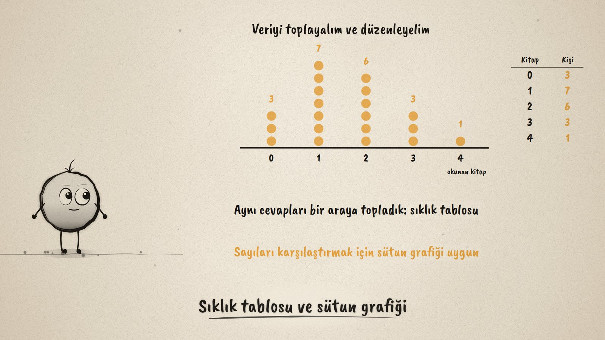
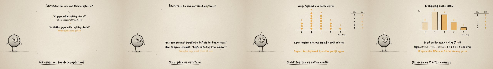

# Soru Sor, Veri Topla · A Statistical Investigation

**▶ Tarayıcıda izleyin / Watch in the browser:** https://hakanatas.github.io/soru-sor-veri-topla/ 
**⬇ MP4 + altyazılar / MP4 + subtitles:** [Releases](https://github.com/hakanatas/soru-sor-veri-topla/releases) 
**✎ Kullanılan istem / The prompt behind it:** [PROMPT.md](PROMPT.md) 
**🎞 Bütün filmler / All films:** [Nokta'nın Filmleri](https://hakanatas.github.io/nokta-filmleri/?sinif=6)

> **TR —** 6. sınıf matematik "İstatistiksel Araştırma Süreci" temasındaki MAT.6.5.1 öğrenme çıktısı için hazırlanmış, tamamen JavaScript ile çizilen 92 saniyelik mürekkep animasyonu. Nokta merak ediyor: sınıfımız ne kadar kitap okuyor? "Ali geçen hafta kaç kitap okudu?" sorusunun tek cevabı var, istatistiksel değil; "Sınıftakiler geçen hafta kaç kitap okudu?" sorusunun farklı cevapları var, veri gerekiyor. Araştırma sorusu ve plan kuruluyor: 20 öğrenciye anket, cevaplar sayı yani nicel (kesikli) veri. 20 cevap geliyor, noktalar halinde değerlerine göre toplanıyor, sıklık tablosu yapılıyor; sayıları karşılaştırmak için sütun grafiği seçiliyor. Analiz: en çok verilen cevap 1 kitap (7 kişi), toplam 32 kitap, öğrencilerin yarısı en az 2 kitap okumuş. Sonuç gerekçesiyle söyleniyor (20 kişiden 13'ü 1 ya da 2 dedi) ve süreç değerlendiriliyor: veri tek haftada toplandı, o hafta sınav haftası olabilir; plan 4 haftaya genişletiliyor. Altyazılar Türkçe, İngilizce ya da ikisi birlikte seçilebilir.

A 92-second ink animation for **6th-grade maths**, the first film of the fifth 6th-grade theme. Nokta, the ink character from [The Learning Ink](https://github.com/hakanatas/the-learning-ink), is the guide again. The 20 answers are one list (`DATA` in `scenes/scene1.js`); each answer flies from its place in the grid to its own slot in the dot plot, and the counts, table and bars are all computed from that same list.

## Learning outcome

MEB, Türkiye Yüzyılı Maarif Modeli, Ortaokul Matematik, 6th grade, "İstatistiksel Araştırma Süreci" theme:

**MAT.6.5.1. Kategorik veya nicel (kesikli) veri ile çalışabilme ve veriye dayalı karar verebilme**
- a) Kategorik veya nicel (kesikli) veriye dayanan istatistiksel araştırma gerektiren durumları fark eder.
- b) Kategorik veya nicel (kesikli) veriye dayanan betimleme veya karşılaştırma gerektirebilecek araştırma soruları oluşturur.
- c) Kategorik veya nicel (kesikli) veriye ulaşmak için plan yapar.
- ç) Araştırma sorusuna uygun hazırlanan anket sorularını kullanarak veri toplar veya hazır veriye ulaşır.
- d) Veri görselleştirme ve özetleme araçlarını seçme gerekçelerini belirtir.
- e) Toplanan veriyi uygun araçlarla analiz eder.
- f) Araştırmada ulaştığı sonuçlara yönelik gerekçeler sunar.
- g) Araştırma sonuçlarının araştırma sorusuna ne düzeyde cevap verdiğini değerlendirerek araştırma sürecine uygun olmayan adımları yeniden planlar.

## Scenes

| # | Time | Scene | What happens | Outcome |
|---|---|---|---|---|
| 1 | 0–10 s | Merak | How much does our class read? Does everyone read the same? | a |
| 2 | 10–28 s | Soru ve plan | One answer or many; the research question, a survey of 20, discrete numerical data. | a, b, c |
| 3 | 28–46 s | Veri topla | 20 answers become a dot plot and a frequency table; a bar chart is chosen, with a reason. | ç, d |
| 4 | 46–64 s | Analiz et | Most common answer 1 book; 32 books in all; half read at least 2. | e |
| 5 | 64–80 s | Sonuç ve değerlendirme | Most read 1 or 2 books (13 of 20); one week may mislead, so the plan is widened to 4 weeks. | f, g |
| 6 | 80–92 s | Aklında kalsın | Question, plan, data, chart, conclusion, review. | a–g |

## Running it

- **Preview:** double-click `index.html` (it works offline).
- **MP4:** run `npm install` once, then `npm run export -- --format=horizontal --captions=tr`.
- **Subtitles and narration:** `npm run srt` writes `out/captions_*.srt` and `narration_notes.txt`.
- **Editing:**
  - Caption text, timings and narration notes: `captions.js`
  - Everything on screen is drawn by `LI.world(t)` in `scenes/scene1.js` (the survey answers in `DATA`, the question cards, the chart and table, the words); the other scenes only set the camera.
  - Nokta's poses: `src/draw/film.js`; layout for 16:9 and 9:16: `src/draw/kd.js`

It uses the same engine as The Learning Ink: `renderFrame(t)` as a pure function of time, seeded randomness, and frame-by-frame export.

## Lisans · License

**TR —** Bu film ve kodu [Creative Commons Atıf-GayriTicari 4.0 Uluslararası (CC BY-NC 4.0)](https://creativecommons.org/licenses/by-nc/4.0/deed.tr) lisansıyla paylaşılır. Ticari olmayan her amaçla (derste, okulda, eğitim materyalinde) kopyalayabilir, paylaşabilir ve değiştirebilirsiniz; ancak **kaynak göstermek zorunludur**: eser sahibinin adı ve bu deponun bağlantısı belirtilmeden kullanılamaz. Ticari kullanım (satış, ücretli ürün ya da yayın) için izin alınmalıdır.

**EN —** This film and its code are licensed under [Creative Commons Attribution-NonCommercial 4.0 International (CC BY-NC 4.0)](https://creativecommons.org/licenses/by-nc/4.0/). You may copy, share and adapt them for non-commercial purposes, but **attribution is required**: they may not be used without crediting the author and linking to this repository. Commercial use requires permission.

Atıf örneği / Required credit: *“Soru Sor, Veri Topla”, Hakan Ataş, Nokta'nın Filmleri — https://github.com/hakanatas/soru-sor-veri-topla — CC BY-NC 4.0*
